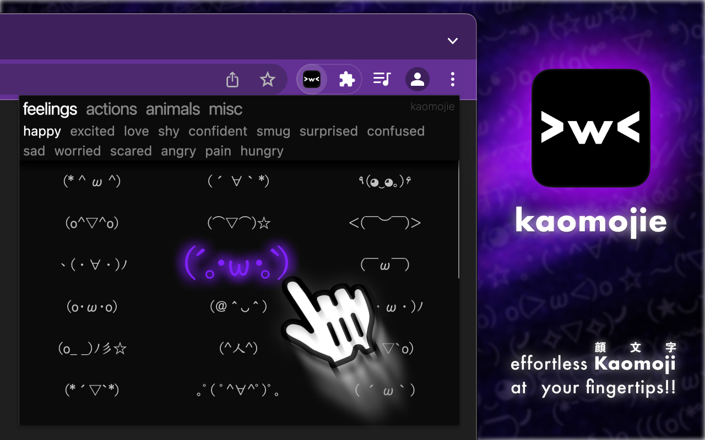

# kaomojie

Git repository for the browser extension **kaomojie**.

**Easy and fast access to hundreds of kaomojis, all categorised!**

 

## Building

We use Gulp to transpile source code and ready the extension for deployment.

1. Install node dependencies: `pnpm install`
2. Build: `pnpm build` (to folder `build`)

`pnpm deploy` also zips up the build for deployment (build/archive.zip).

## License

This software is licensed under AGPL 3.0; a copy can be found under [LICENSE](LICENSE).
